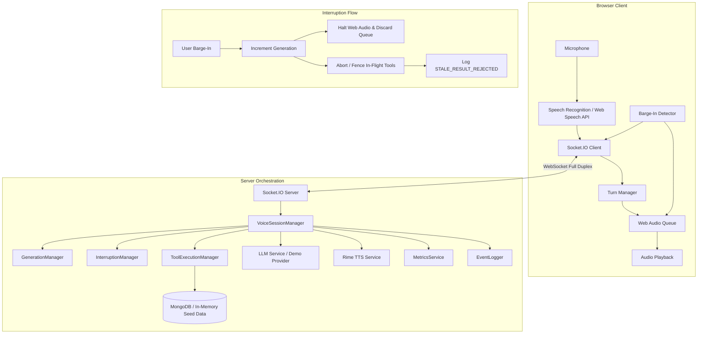

# VoiceOps

> **Voice-Native, Hands-Free AI Operations Assistant with Interruption-Safe Full-Duplex Voice & Rime Speech Synthesis**
> Built for the Rime Hackathon.

---

## 1. The Problem
Field technicians, line mechanics, and manufacturing operators frequently work in environments where their hands and eyes are occupied with high-voltage machinery, hydraulic pumps, or dirty mechanical components. Using a phone, tablet, or terminal requires removing protective gloves, leaving the equipment, and interrupting operations.

Traditional voice assistants fail drastically in these workflows because:
- If a user changes their mind or issues an emergency stop while an assistant is speaking or awaiting a slow diagnostic query, standard architectures either ignore the user, queue obsolete speech, or let late-arriving queries overwrite the user's latest commands.

VoiceOps solves this hard voice challenge through **Generation Versioning & Stale Result Fencing**.

---

## 2. Hard Voice Challenge: Interruption & Recovery During Long-Running Tools
When a technician speaks while VoiceOps is active:
1. **Instant Audio Halting:** Audio playback stops immediately (< 300 ms) via the Web Audio API without draining buffered obsolete chunks.
2. **Generation Invalidation:** The conversational generation counter increments.
3. **Tool Fencing:** Asynchronous API and database requests are tagged with the generation ID. If an operation was slow (e.g. simulated 5-second tool delay) and completes after an interruption, its result is verified against `currentGenerationId` and **strictly rejected** as `STALE_RESULT_REJECTED`.
4. **Clean State Transitions:** The new instruction runs without corrupting the UI, active equipment state, or conversational memory.

---

## 3. Architecture



---

## 4. Technology Stack
- **Frontend:** React 18, TypeScript, Vite, Tailwind CSS, Zustand, Lucide React, Recharts, Web Audio API, Web Speech API.
- **Backend:** Node.js, Express, Socket.IO (full duplex), Mongoose / MongoDB, Axios, Winston structured logger.
- **Voice Synthesis:** **Rime TTS** (`https://users.rime.ai/v1/rime-tts`) with model `mist` and speaker `cove`.
- **Intelligence:** LLM Service abstraction with `DemoProvider` (zero-configuration realistic industrial operations engine) and `OpenAIProvider`.

---

## 5. Rime Integration Highlights
- **Server-Side Security:** Rime API keys remain strictly on the backend.
- **Natural Phrasing for the Ear:** Text processed for Rime uses concise sentence chunking, safety-first phrasing, and clear pauses.
- **Active Provider Visibility:** Visible in the Evidence Lab and Operational Context panels with model (`mist`), speaker (`cove`), and transport details.

---

## 6. Official Acceptance Test: Belt 4 → Belt 7

### Scenario:
1. **User:** *"Find the maintenance procedure for Conveyor Belt 4 and guide me through the inspection."*
   - Turn begins with a **5000 ms tool delay**.
2. **User Interrupts:** *"Stop. Actually check Conveyor Belt 7 instead and only give me the safety inspection."*
3. **Expected & Verified Result:**
   - Conveyor 4 audio terminates instantly.
   - Conveyor 4 late diagnostic result arrives and is discarded with `STALE_RESULT_REJECTED`.
   - Conveyor 7 safety inspection is retrieved and spoken via Rime.
   - Active equipment immediately updates to Belt 7.
   - Status: **PASSED ✓**

---

## 7. Getting Started

### Prerequisites
- Node.js 18+
- npm 9+
- (Optional) MongoDB running locally on port 27017

### Installation
```bash
# Clone repository
git clone https://github.com/your-username/VoiceOps.git
cd VoiceOps

# Copy environment template
cp .env.example .env

# Install dependencies
npm run install:all
```

### Environment Configuration (`.env`)
```env
PORT=5000
MONGODB_URI=mongodb://localhost:27017/voiceops
CLIENT_URL=http://localhost:5173

# Rime TTS Credentials
RIME_API_KEY=your_rime_api_key_here
RIME_MODEL=mist
RIME_SPEAKER=cove
RIME_ENDPOINT=https://users.rime.ai/v1/rime-tts

# LLM Provider (defaults to demo with rich simulated data)
LLM_PROVIDER=demo
SIMULATED_TOOL_DELAY_MS=5000
```

### Running Locally
```bash
# Start backend server and client concurrently
npm run dev

# Or start individually:
npm run dev:server
npm run dev:client
```
Open **`http://localhost:5173`** in your browser.

---

## 8. Testing & Evidence
- **Automated Tests:**
  ```bash
  npm run test              # Unit tests for GenerationManager & ToolExecutionManager
  npm run test:interruption # Acceptance test verifying stale tool fencing
  ```
- **Live Evidence Lab:** Visit `http://localhost:5173/evidence` for the interactive acceptance test runner, live latency telemetry, and event timeline inspection.
